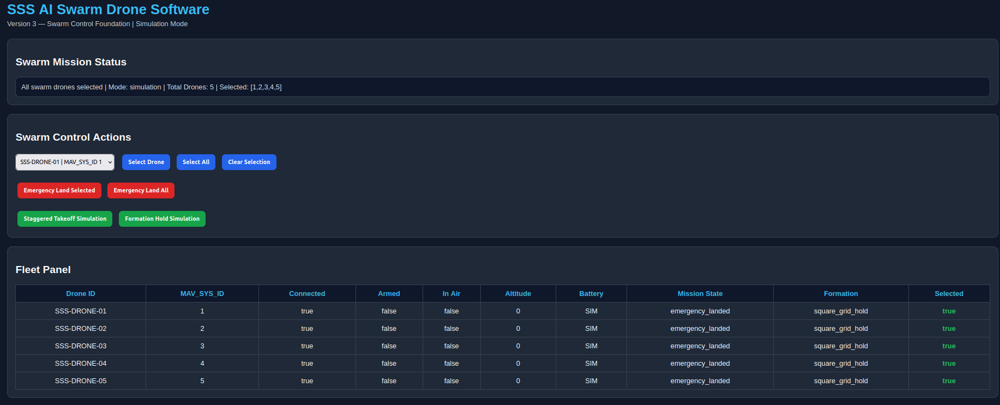
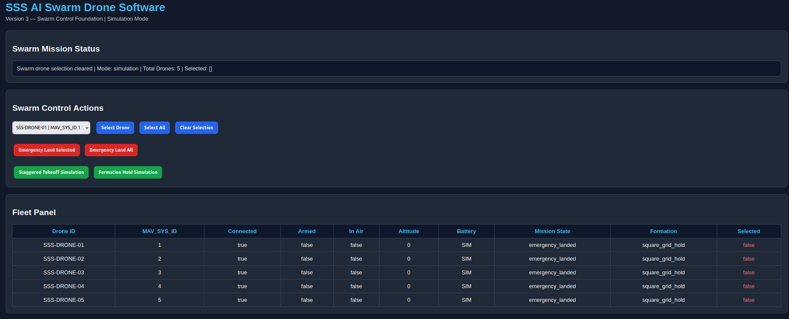
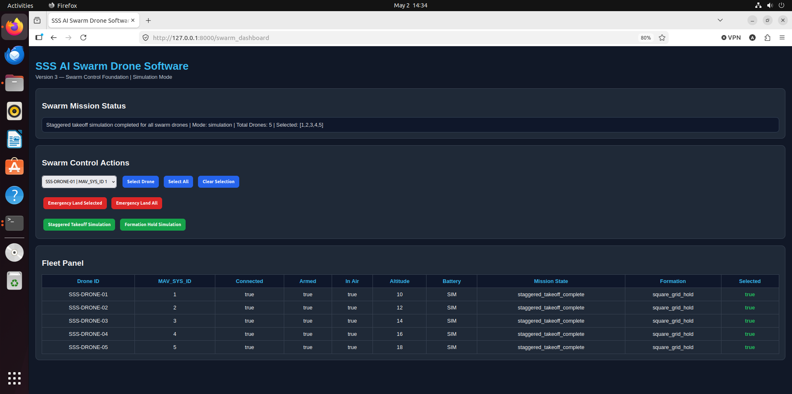
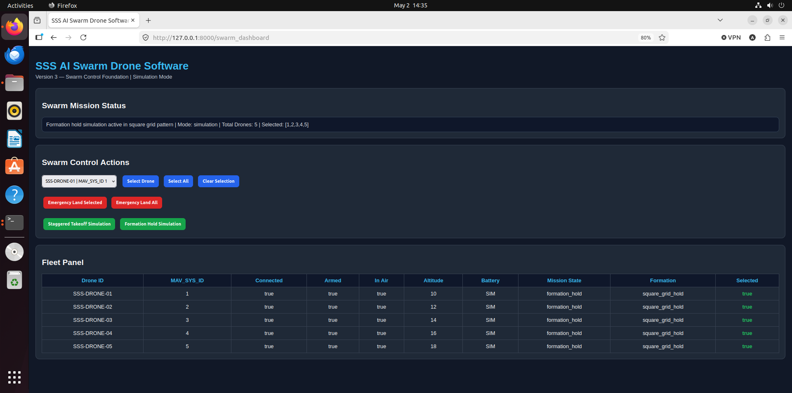
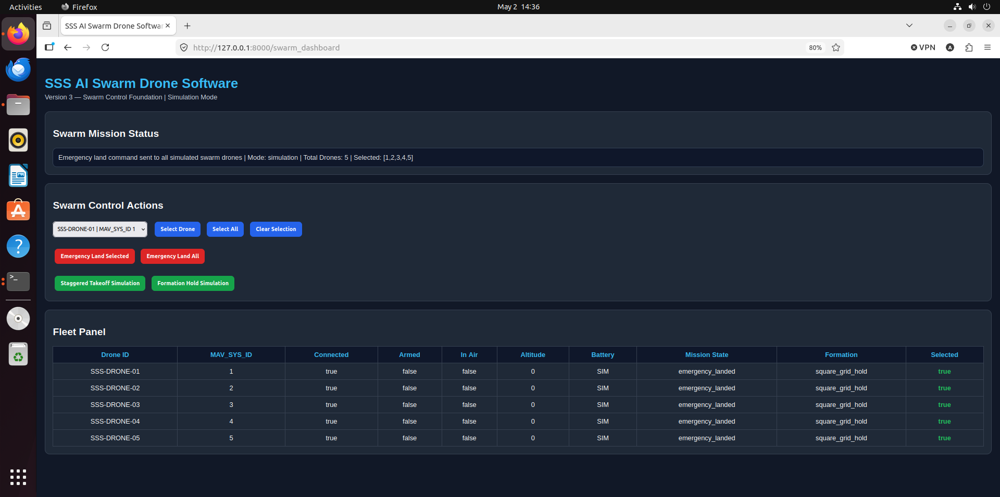

# SSS Autonomous Drone AI Platform

## Project Overview

The SSS Autonomous Drone AI Platform is a browser-based drone command, telemetry, and emergency recovery interface designed to support multiple autonomous drone categories, including multirotor, fixed-wing, and VTOL platforms.

The current version runs in a PX4 SITL simulation environment and connects through FastAPI, MAVSDK, and MAVLink. The platform provides a clean operator dashboard for monitoring drone status, selecting drone control profiles, sending mission commands, tracking command history, viewing altitude data, and using emergency recovery controls.

The long-term goal is to connect this platform to SSS-built drone hardware using PX4 or ArduPilot-compatible flight controllers, MAVLink telemetry, secure communications, and operator-supervised autonomy.

## Version 6 — Swarm Simulation Expansion

Version 6 expands the SSS AI Swarm Drone Software from dynamic fleet management into a simulation-only swarm mission operations system.

### Version 6 Features

- Simulated swarm mission assignment
- Simulated mission start
- Simulated mission progress advancement
- Simulated mission reset
- Mission state tracking:
  - idle
  - assigned
  - in_progress
  - completed
  - emergency
- Mission type selector:
  - surveillance
  - area_scan
  - perimeter_watch
  - search_pattern
- Formation selector:
  - line
  - column
  - wedge
  - grid
  - hold
- Mission progress tracking:
  - 0%
  - 25%
  - 50%
  - 75%
  - 100%
- Dashboard mission simulation control panel
- Live mission progress display
- Fleet panel updates for mission state, formation, in-air state, and altitude
- Simulation reset returns drones to safe idle state

### Version 6 Backend Routes

- `POST /assign_simulated_mission`
- `POST /start_simulated_mission`
- `POST /advance_simulated_mission`
- `POST /reset_simulated_mission`
- `GET /swarm_status`

### Version 6 Safety Note

Version 6 remains simulation-only. The mission assignment, mission start, mission progress, mission reset, formation selection, and dashboard mission controls update only simulated software state. They do not send real MAVSDK, MAVLink, PX4, ArduPilot, or physical drone flight commands.

## Version 5 — Dynamic Swarm Fleet Management

Version 5 upgrades the SSS AI Swarm Drone Software from a fixed 5-drone simulation fleet into a dynamic simulation fleet management system.

### Version 5 Features

- Dynamic Add Drone feature
- Dynamic Remove Drone feature
- Default startup fleet remains 5 drones
- Dynamic total drone count
- Dynamic drone dropdown in the dashboard
- Dynamic fleet table updates
- Drone role support:
  - leader
  - follower
  - reserve
- Dashboard role selector
- Dashboard Add Drone button
- Dashboard Remove Selected Drone button
- Backend swarm health summary
- Dashboard swarm health summary panel
- Simulation-only safety design

### Version 5 Backend Routes

- `GET /swarm_status`
- `POST /add_drone`
- `POST /remove_drone`
- `POST /select_drone`
- `POST /select_all_drones`
- `POST /clear_selection`
- `POST /emergency_land_selected`
- `POST /emergency_land_all`
- `POST /staggered_takeoff_sim`
- `POST /formation_hold_sim`

### Version 5 Safety Note

Version 5 remains simulation-only. The Add Drone, Remove Drone, role selection, swarm health summary, and dashboard fleet controls update only the simulated software state. They do not send real MAVSDK, MAVLink, PX4, ArduPilot, or physical drone flight commands.

## Key Features

- Browser-based drone command dashboard
- PX4 SITL simulation integration
- FastAPI backend
- MAVSDK / MAVLink drone communication
- Live drone connection status
- Mission state indicator
- Live telemetry display
- Command history panel
- Altitude monitor with visual bar
- Emergency recovery panel
- Operational safety section
- Dynamic drone mode selector
- Multirotor, fixed-wing, and VTOL control profiles
- Startup scripts for PX4 and the web platform

## Supported Drone Modes

### Multirotor Mode

Designed for vertical takeoff and landing drones.

Controls shown:

- Arm Drone
- Launch Drone
- Hover Forward
- Land Drone
- Hold Position

### Fixed-Wing Mode

Designed for future fixed-wing autonomous drone platforms.

Controls shown:

- Arm System
- Launch Sequence
- Start Mission
- Return to Base
- Loiter Area

### VTOL Mode

Designed for future vertical takeoff and transition-flight drone platforms.

Controls shown:

- Arm System
- Vertical Takeoff
- Transition Flight
- Vertical Landing
- Mission Hold

## System Architecture

The current simulation workflow is:

Browser User Interface
        |
        v
FastAPI Web Server
        |
        v
MAVSDK Python
        |
        v
MAVLink
        |
        v
PX4 SITL Simulator
        |
        v
gz_x500 Drone Model

## Tools and Technologies

- Ubuntu 22.04
- Oracle VirtualBox
- PX4 Autopilot
- PX4 SITL
- Gazebo gz_x500 simulation model
- Python 3
- FastAPI
- Uvicorn
- MAVSDK
- MAVLink
- HTML/CSS browser dashboard
- Bash startup scripts

## Folder Structure

sss_autonomous_drone_ai_platform/
├── README.md
├── connect_test.py
├── takeoff_land.py
├── web_app.py
├── start_px4.sh
├── start_platform.sh
└── screenshots/

## How to Run the Platform

### 1. Start PX4 SITL

Open the first terminal:

cd ~/sss_autonomous_drone_ai_platform
./start_px4.sh

### 2. Start the Web Platform

Open the second terminal:

cd ~/sss_autonomous_drone_ai_platform
./start_platform.sh

### 3. Open the Dashboard

Open a browser and go to:

http://127.0.0.1:8000

## Screenshots

Project screenshots are stored in the screenshots/ folder. They show the dashboard, drone mode selector, telemetry indicators, command history, altitude monitor, safety controls, and PX4/Gazebo simulation environment.

## Current Status

This version has been tested in a PX4 SITL simulation environment using the gz_x500 drone model. The platform successfully connects to the drone simulator, displays live status information, and provides a browser-based control interface for simulated mission operations.

## Future Improvements

Planned improvements include:

- Real drone hardware integration
- GPS waypoint mission planning
- Obstacle detection support
- AI-assisted mission decision-making
- Secure remote operator access
- Flight log storage and review
- Role-based user authentication
- Integration with SSS drone hardware prototypes

## Author

Ammar Aldarraji  
U.S. Army Veteran | Cybersecurity Analyst | Drone AI / Autonomous Systems Portfolio Project

---

## Version 3 — Swarm Control Foundation

Version 3 begins the transition from a single-drone command dashboard into the SSS AI Swarm Drone Software platform. This version is still simulation-first and does not send real swarm flight commands to physical drones.

The goal of Version 3 is to build the software foundation for future 5-to-50 drone swarm operations while keeping all testing safe inside simulation.

### Version 3 Features

- Professional SSS AI Swarm Drone Software dashboard
- Simulation-only 5-drone swarm fleet panel
- Drone ID and MAV_SYS_ID display
- Per-drone status tracking:
  - Connected
  - Armed
  - In Air
  - Altitude
  - Battery placeholder
  - Mission state
  - Formation state
  - Selection state
- Select single drone
- Select all drones
- Clear drone selection
- Emergency land selected drone simulation
- Emergency land all drones simulation
- Staggered takeoff simulation
- Formation hold simulation
- Swarm mission status display
- Safe backend API routes for swarm state management

### Version 3 Backend Routes

- `GET /swarm_status`
- `POST /select_drone`
- `POST /select_all_drones`
- `POST /clear_selection`
- `POST /emergency_land_selected`
- `POST /emergency_land_all`
- `POST /staggered_takeoff_sim`
- `POST /formation_hold_sim`
- `GET /swarm_dashboard`

### Version 3 Safety Note

All Version 3 swarm actions are simulation-only. The emergency land, staggered takeoff, and formation hold functions update the simulated software state only. They do not send real MAVSDK, MAVLink, PX4, or physical drone flight commands.

QGroundControl may still be used later as a temporary safety and setup tool during real drone testing, but the long-term goal is to continue building the company-owned SSS AI Swarm Drone Software platform.

### Version 3 Screenshots

#### Select Drone Test


#### Select All Test



#### Clear Selection Test



#### Staggered Takeoff Simulation



#### Formation Hold Simulation



#### Emergency Land All Simulation




---

## Version 4 — Swarm Architecture Upgrade

Version 4 improves the software architecture of the SSS AI Swarm Drone Software platform. The goal of this version is to make the project cleaner, easier to maintain, and easier to scale toward future 5-to-50 drone swarm operations.

Version 4 does not add real physical drone flight commands. The platform remains simulation-first and safe for software development.

### Version 4 Architecture Changes

- Separated swarm state into `swarm_state.py`
- Separated swarm backend API routes into `swarm_routes.py`
- Moved the swarm dashboard HTML into `templates/swarm_dashboard.html`
- Moved dashboard styling into `static/swarm_dashboard.css`
- Moved dashboard JavaScript into `static/swarm_dashboard.js`
- Mounted the `static/` folder in FastAPI
- Connected the swarm router to the main FastAPI application
- Removed duplicate swarm backend routes from `web_app.py`
- Updated `/swarm_dashboard` to use the new Version 4 template
- Removed the temporary `/swarm_dashboard_v4` test route after successful testing

### Version 4 Project Structure

```text
sss_autonomous_drone_ai_platform/
├── web_app.py
├── swarm_state.py
├── swarm_routes.py
├── templates/
│   └── swarm_dashboard.html
├── static/
│   ├── swarm_dashboard.css
│   └── swarm_dashboard.js
├── screenshots/
│   └── version3/
├── README.md
├── start_platform.sh
├── start_px4.sh
├── connect_test.py
└── takeoff_land.py
